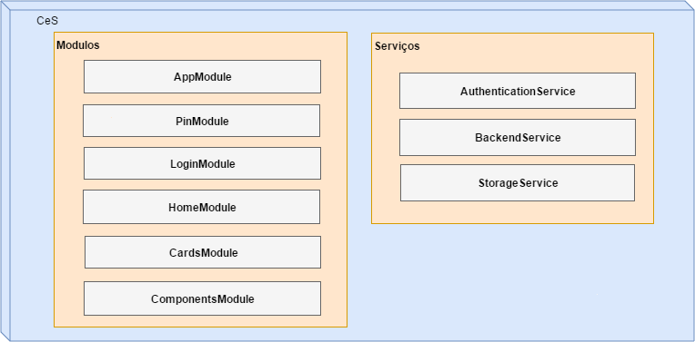
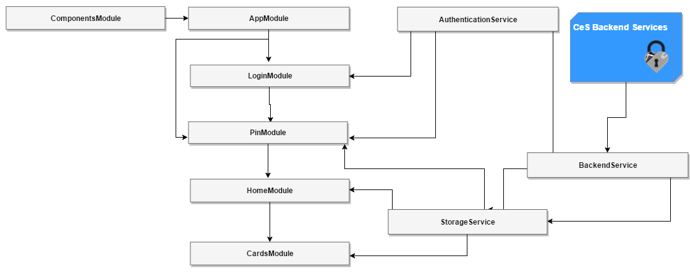
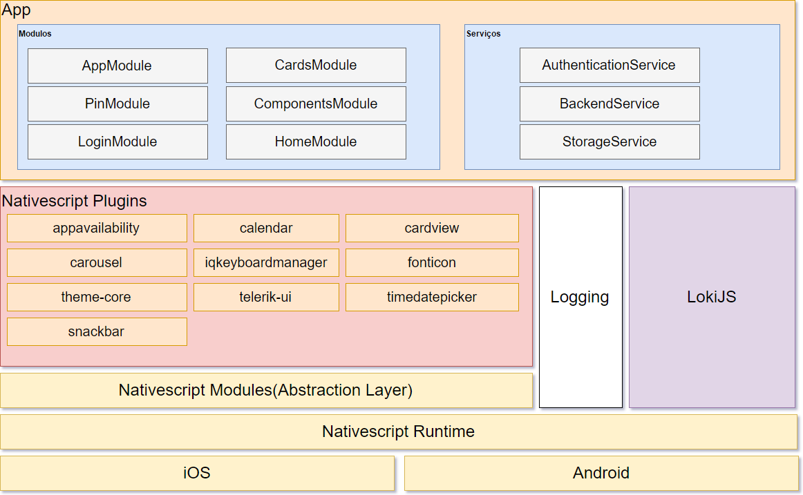

# Arquitetura da Aplicação

A aplicação CeS é desenvolvida em Angular 2, pelo que apresenta a arquitectura demonstrada no  diagrama anterior.   
De o modo geral, é constituida por 2 componentes gerais: **Módulos** e **Serviços**.

### Módulos

Entre os módulos, cada um destes tem a sua responsabilidade, facilitando assim uma manutenção mais simples.

**AppModule** -  Cada aplicativo tem pelo menos um módulo Angular, o módulo raiz \(_root_\) que inicia o aplicativo. Cartões de Introdução e Error \(páginas de erro\),

**PinModule** - modulo para registo do PIN da Carteira, autenticação e mudança de PIN, com ligação ao serviço encriptado de Autenticação. O PIN fica guardado apenas no armazenamento do dispositivo móvel \(Storage Service\).

**LoginModule** - componente de autenticação na aplicação. Mediante o serviço de autenticação escolhido \(Chave Móvel Digital ou Registo Nacional de Utente \)

**CardsModule** - Coteúdo dos cartões \(view de Cartões da CeS em detalhe\)

**HomeModule** - view de Cartões da CeS \(vista fechada\), Menus \( Settings e About\), CardsList, adicionar, visualizar e remover cartões.

**ComponentsModule** - componentes de interface \(navigation drawer, scroll, etc\)

### Serviços

**AuthenticationService** - Autenticação e ligação aos servidores  \(Backend\) de forma segura e encriptada.

**BackendService** - ligação às base de dados dos vários sistemas de informação \(centrais e locais\) e o Servidor CeS \(Azure Container Service -Docker Swarm\) é feita usando o protocolo HTTPS \(ver diagrama 1\)

Toda a informação trocada é ainda encriptada e assinada digitalmente usando os algoritmos de encriptação RSA \(2048 bit\) e AES \(256 bit\). O formato de dados utilizado é [JOSE - JSON Object Signing and Encryption](https://datatracker.ietf.org/wg/jose/documents/). O par de chaves RSA do servidor está alojado no Azure Key Vault, sendo as operações de assinatura e desencriptação efetuadas lá.

**Storage Service** - Serviço de armazenamento de dados no dispositivo móvel, devidamente encriptado. Através deste serviço, é armazenado o PIN, Home View e os cartões.

**CeS Backend Services** - conjunto de serviços de apoio ao funcionamento da CeS \(autenticação, comunicação, telemetria.\)

### Comunicação

## Arquitetura NativeScript

Para mais informações sobre a arquitetura default de nativescript consulte esta [secção](desenvolvimento.md)

### Plugins

[appavailability](http://plugins.nativescript.org/plugin/nativescript-appavailability) -  para verificar a disponibilidade de outros aplicativos no dispositivo

[calendar](http://plugins.nativescript.org/plugin/nativescript-calendar) - permite manipular eventos no calendário nativo do dispositivo, permitindo apagar, criar, eliminar e encontrar eventos. Na CeS, é utilizado para adicionar eventos de levantamento de prescrições da eGuia de Tratamento.

[cardview](http://plugins.nativescript.org/plugin/nativescript-cardview) - fornece um widget XML para implementar o componente[Material Design CardView](https://material.io/guidelines/components/cards.html)

[carousel](http://plugins.nativescript.org/plugin/nativescript-carousel) - efeito carousel, utilizado nos ecrãs informativos iniciais

[iqkeyboardmanager](http://plugins.nativescript.org/plugin/nativescript-iqkeyboardmanager) - wrapper para iOS que impede a a sopreposição do teclado nos controlos UITextView  
[fonticon](http://plugins.nativescript.org/plugin/nativescript-fonticon) - font icons com NativeScript  
[theme-core](http://plugins.nativescript.org/plugin/nativescript-theme-core) - core NativeScript theme  
[telerik-ui](http://plugins.nativescript.org/plugin/nativescript-telerik-ui) - Telerik UI  
[timedatepicker](http://plugins.nativescript.org/plugin/nativescript-timedatepicker) - selectores de data e hora para Android e iOS  
[snackbar](http://plugins.nativescript.org/plugin/nativescript-snackbar) - Material Design Snackbar para Android e SSSnackbar Cocoapod para iOS

