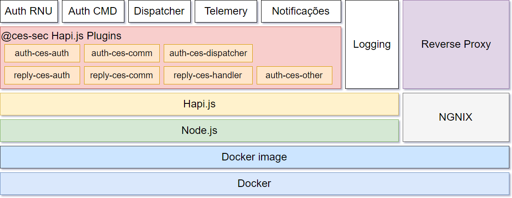

#Backend - Serviços

#### Azure Container Service
Nesta aplicação utilizou-se o **Azure Container Service** com uma implementação do Docker Swarm. O Docker Swarm, utilizando a API do Docker nativa, fornece um ambiente para a implementação de cargas de trabalho de conteúdo através de um conjunto agrupado de anfitriões de Docker. 

No diagrama acima, é possivel identificar duas secções no Container Service: **Core** e **Integrações**

As integrações são os **serviços externos**,  que facilitam o acesso aos servidores SPMS e ADSE. Para tal, criou-se uma interface para cada serviço acedido (RNU, PEM, ADSE).

No **Core** do Azure Container Service, encontram-se os serviços que comunicam com a base de dados **DocumentDB**, responsável pelo armazenamento de _logs_ encriptados  para diagnóstico de problemas de funcionamento da aplicação, telemetria, associação (encriptada) do dispositivo ao cidadão e ainda metadatas de cartões, notificações e dispatcher. Estes dados não são armazenados no dispositivo móvel, mas sim da base de dados de backend (DocumentDB),

# FALTAM INFOS AQUI

#### Especificações de acesso a serviços e frameworks utilizadas

## Web and services application framework: [Hapi.Js](https://hapijs.com/) + Typescript

	* [github - seed-hapi](https://github.com/dwyl/hapi-typescript-example)
 
 ###Plugins Hapi.js criados:
 ####Autenticação
    * auth-ces-auth
    * auth-ces-comm
    * auth-ces-dispatcher
    * auth-ces-other
 ####Resposta
    * reply-ces-auth
    * reply-ces-comm
    * reply-ces-handler
    
##Azure Key Vault:
O cofre de chave do Azure ajuda a salvaguardar as chaves criptográficas e os segredos utilizados pelas aplicações em nuvem e pelos serviços. 

	* [mais informações](https://docs.microsoft.com/pt-pt/azure/key-vault/key-vault-whatis)
	* [npm](https://www.npmjs.com/package/azure-keyvault)
	* [API docs](http://azure.github.io/azure-sdk-for-node/azure-keyvault/latest/)

##(RSA) jsrsasign
'jsrsasign' (RSA-Sign JavaScript Library) é uma biblioteca criptográfica opensouce que suporta RSA/RSAPSS/ECDSA/DSA signing/validation, ASN.1, PKCS#1/5/8 private/public key, X.509 certificate, CRL, CMS SignedData, TimeStamp & CAdES e JSON Web Signature(JWS)/Token(JWT)/Key(JWK)

	* [site](http://kjur.github.io/jsrsasign/)
	* [npm](https://www.npmjs.com/package/jsrsasign)
	* [API docs](https://kjur.github.io/jsrsasign/api/index.html)
	
	* certificados CA:
  		* [JS Certification Authority](https://kjur.github.io/jsrsasign/tool_ca.html)

##Crypt AES - Crypto-js
Crypto-js é uma biblioteca JavaScript de padrões de criptografia.
	
	* [github](https://github.com/brix/crypto-js)
	* [npm](https://www.npmjs.com/package/crypto-js)

##Validação de JSON
	
	* [site](http://json-schema.org)
	* [npm](https://www.npmjs.com/package/jsonschema)
	* [conversão de tipos typescript e JSON Schema - github](https://github.com/YousefED/typescript-json-schema)

##TOTP
Para a gestão de passwords, utilizou-se o One-Time Password manager. Compativel com  HOTP (counter based one time passwords) e TOTP (time based one time passwords). Suporta autenticação de dois fatores.

	* [npm](https://www.npmjs.com/package/otp.js)

##JSON Web Key (JWK) - para Storage
    * [Docs](https://tools.ietf.org/html/rfc7515)
##JSON Web Signature (JWS) - Payload JWE
    * [Docs](https://tools.ietf.org/html/rfc7515)
##JSON Web Encryption (JWE) - Payload MessageAction(CeS)
    * [Docs](https://tools.ietf.org/html/rfc7516)
